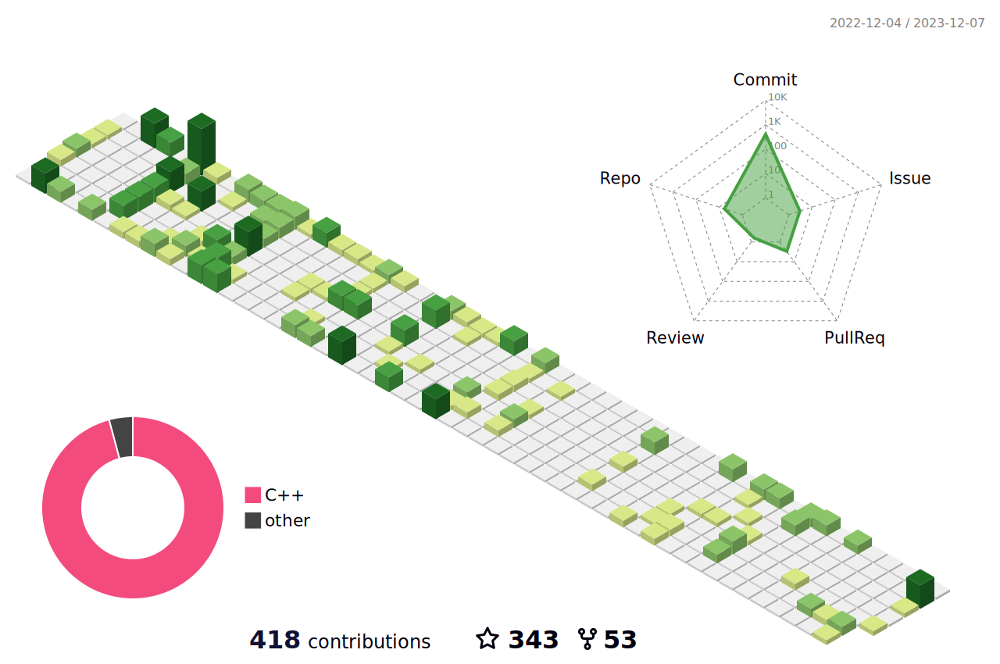

<h1 align="center">Hi there ...</h1> 

<h4 align="center">
  I'm a Junior C Embedded Engineer
</h4>

Here are some ideas to get you started:
- 🔭 I’m currently working on DZS
- 🌱 I’m currently learning linux c/c++
- 💞️ I’m looking to collaborate on ...
- 📫 How to reach me yt147612165686@gmail.com
- 😄 Pronouns: ...
- ⚡ Fun fact: ...

<h4 align="center">
  you can ask me about anything 💬<a href="https://github.com/Italink/Italink/issues/new" target="_blank" title="issue">here</a>
</h4>

<h5 align="center">
  
   <a href="https://www.zhihu.com/people/volleritoo" target="_blank" title="zhihu">&nbsp;知乎&nbsp;&nbsp;&nbsp;</a>
</h5>

<h5 align="center">
 
 <a href="https://space.bilibili.com/306494243" target="_blank" title="bilibili">&nbsp;Bilibili</a>
</h5>

